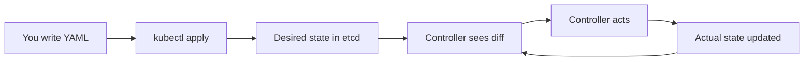
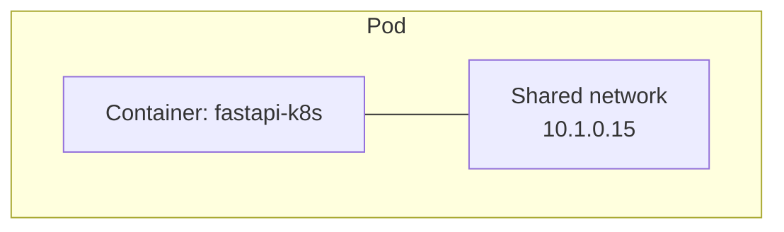
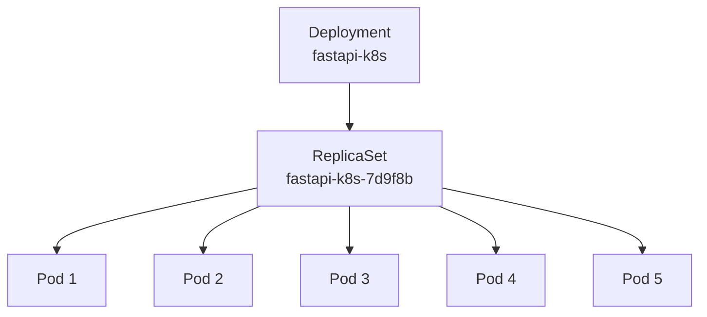
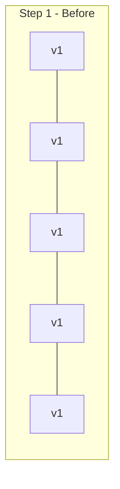
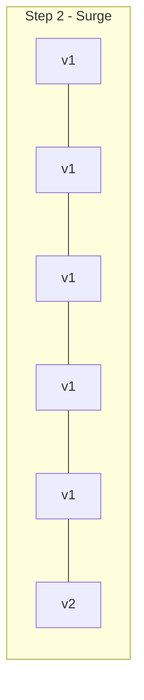
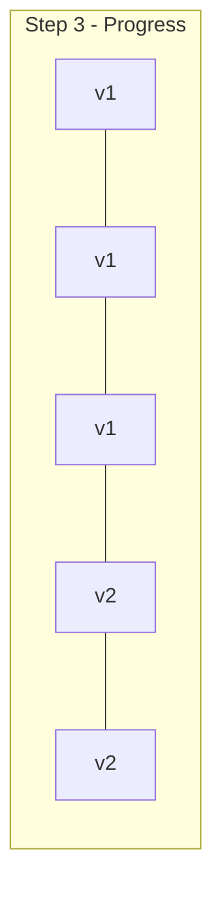
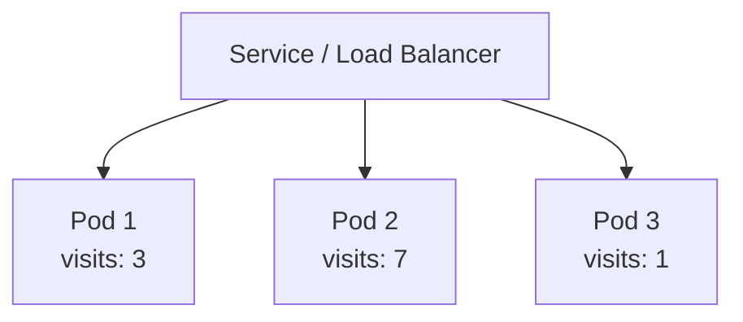
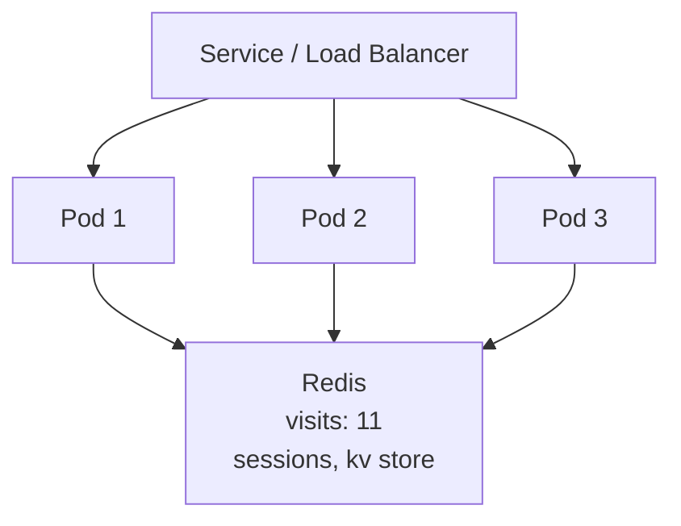
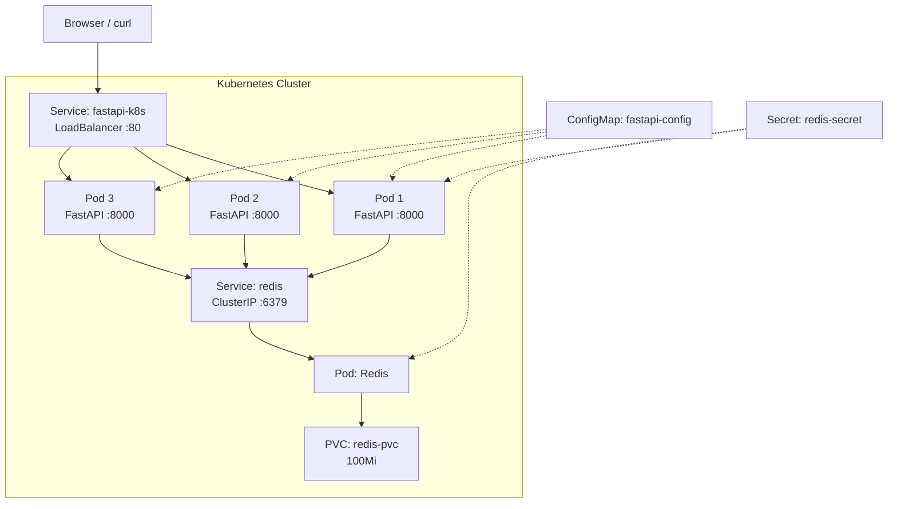

# Kubernetes

What we learned deploying a FastAPI app to K8s

<style>
.slidev-layout { font-size: 0.85em; }
.slidev-layout h1 { font-size: 1.75em; }
.slidev-layout h3 { font-size: 1.15em; }
.slidev-layout pre, .slidev-layout code { font-size: 0.9em; }
.slidev-layout table { font-size: 0.9em; }
.slidev-layout td, .slidev-layout th { padding: 0.25em 0.6em; }
</style>

---

# Three ideas that change everything

<v-clicks>

### 1. You declare what you want, not what to do

Kubernetes reads your YAML and **continuously** reconciles reality to match.
You don't script steps -- you describe the end state.

### 2. Pods die. That's the design.

Nothing is permanent. Pods crash, get evicted, restart.
Every K8s pattern -- Services, PVCs, probes -- exists because of this.

### 3. The layers exist for a reason

Deployment &rarr; ReplicaSet &rarr; Pod. Service &rarr; Endpoints &rarr; Pod IPs.
Each layer adds one capability: scaling, updates, stable networking.

</v-clicks>

---

# Five concepts that make Kubernetes click

- **Declarative desired state** -- you write YAML describing what you want (replicas, images, ports); Kubernetes continuously reconciles the cluster to match
- **Pods, Services, Deployments** -- pods run containers, Services give them stable DNS names, Deployments manage rolling updates and scaling
- **Self-healing through probes** -- liveness probes restart crashed containers, readiness probes remove unhealthy pods from traffic, and failed pods are automatically replaced
- **Config and storage are separate resources** -- ConfigMaps and Secrets inject environment variables without rebuilding images; PersistentVolumeClaims keep data alive across pod restarts
- **Stateless scales freely, stateful needs care** -- stateless apps get more replicas; stateful services like Redis need single-replica strategies and external stores for shared state

---
layout: section
---

# 1. Declarative System

You describe **what**, Kubernetes figures out **how**

---

# Imperative vs Declarative

<div class="grid grid-cols-2 gap-8">
<div>

### Imperative (scripting)

```bash
docker run --name app1 myimage
docker run --name app2 myimage
docker run --name app3 myimage
# What if app2 dies?
# You need monitoring + restart logic
```

</div>
<div>

### Declarative (Kubernetes)

```yaml
spec:
  replicas: 3
```

Apply it. Walk away.

K8s **watches** the actual state and continuously drives it toward the desired state.

Pod dies? A new one appears. No scripts needed.

</div>
</div>

---

# The reconciliation loop



- The controller loop runs **continuously**
- `kubectl apply` is idempotent -- run it 100 times, same result
- Every resource in K8s follows this pattern

---
layout: section
---

# 2. Pods

The smallest deployable unit -- not containers

---

# What is a Pod?

<div class="grid grid-cols-2 gap-8">
<div>

A pod wraps **one or more containers** that share:

- Network namespace (same IP, same localhost)
- Storage volumes
- Lifecycle (start together, stop together)

In practice, **most pods run a single container**.

</div>
<div>



Key insight: you never deploy a container directly.
You always deploy a pod.

</div>
</div>

---
layout: section
---

# 3. The Three-Layer Hierarchy

Deployment &rarr; ReplicaSet &rarr; Pod

---

# Deployment &rarr; ReplicaSet &rarr; Pod



| Layer | Responsibility |
|-------|---------------|
| **Deployment** | Rolling updates, rollback history, strategy |
| **ReplicaSet** | Maintains exact replica count |
| **Pod** | Runs the container(s) |

You only create the Deployment. K8s creates the rest.

---
layout: section
---

# 4. Services

Stable networking for ephemeral pods

---

# Why Services exist

<div class="grid grid-cols-2 gap-8">
<div>

**The problem:**

Pods get new IPs on every restart.

```
fastapi-k8s-abc12  10.1.0.15  # dies
fastapi-k8s-def34  10.1.0.22  # new IP
```

**The solution:**

A Service provides a **stable DNS name and IP** that load-balances across healthy pods.

</div>
<div>

```yaml
apiVersion: v1
kind: Service
metadata:
  name: fastapi-k8s
spec:
  type: LoadBalancer
  ports:
    - port: 80
      targetPort: 8000
  selector:
    app: fastapi-k8s
```

`selector: app: fastapi-k8s` matches all pods with that label.

</div>
</div>

---
layout: section
---

# 5. ConfigMaps and Secrets

Separate config from code

---

# ConfigMap in action

<div class="grid grid-cols-2 gap-8">
<div>

```yaml
apiVersion: v1
kind: ConfigMap
metadata:
  name: fastapi-config
data:
  APP_NAME: "fastapi-k8s"
  LOG_LEVEL: "info"
  MAX_STRESS_SECONDS: "30"
  REDIS_HOST: "redis"
  REDIS_PORT: "6379"
```

</div>
<div>

Injected as environment variables:

```yaml
envFrom:
  - configMapRef:
      name: fastapi-config
```

Change config, restart pods -- no rebuild needed.

Secrets work the same way but are **base64-encoded** (not encrypted). Treat them as sensitive.

```yaml
valueFrom:
  secretKeyRef:
    name: redis-secret
    key: REDIS_PASSWORD
```

</div>
</div>

---
layout: section
---

# 6. Resource Requests and Limits

Control scheduling and stability

---

# Requests vs Limits

```yaml
resources:
  requests:
    cpu: "50m"      # guaranteed minimum
    memory: "64Mi"
  limits:
    cpu: "200m"     # hard ceiling
    memory: "128Mi"
```

| | CPU | Memory |
|---|-----|--------|
| **Over request** | Allowed (uses idle capacity) | Allowed |
| **Over limit** | Throttled | OOMKilled |

**QoS classes** (determines eviction order):

- **Guaranteed** -- requests = limits (last to be evicted)
- **Burstable** -- requests &lt; limits (evicted after BestEffort)
- **BestEffort** -- no requests or limits (evicted first)

---
layout: section
---

# 7. Health Probes

Liveness and readiness drive self-healing

---

# Two probes, two purposes

<div class="grid grid-cols-2 gap-8">
<div>

### Liveness probe

"Is this container alive?"

Failure = **restart the container**

```yaml
livenessProbe:
  httpGet:
    path: /health
    port: 8000
  initialDelaySeconds: 3
  periodSeconds: 10
```

</div>
<div>

### Readiness probe

"Can this container serve traffic?"

Failure = **remove from Service endpoints**

```yaml
readinessProbe:
  httpGet:
    path: /ready
    port: 8000
  initialDelaySeconds: 2
  periodSeconds: 5
```

</div>
</div>

Together: unhealthy pods get restarted **and** stop receiving traffic while recovering.

---
layout: section
---

# 8. Rolling Updates

Zero-downtime deployments

---

# How rolling updates work

```yaml
strategy:
  type: RollingUpdate
  rollingUpdate:
    maxSurge: 1        # 1 extra pod during update
    maxUnavailable: 0  # never go below desired count
```







New pods start **before** old ones stop. Rollback: `kubectl rollout undo deployment/fastapi-k8s`

---
layout: section
---

# 9. Horizontal Pod Autoscaler

Scale based on metrics

---

# HPA configuration

```yaml
apiVersion: autoscaling/v2
kind: HorizontalPodAutoscaler
metadata:
  name: fastapi-k8s-hpa
spec:
  scaleTargetRef:
    apiVersion: apps/v1
    kind: Deployment
    name: fastapi-k8s
  minReplicas: 2
  maxReplicas: 10
  metrics:
    - type: Resource
      resource:
        name: cpu
        target:
          type: Utilization
          averageUtilization: 50
```

- **metrics-server** provides the CPU/memory data
- HPA checks every 15 seconds
- Scale-up is fast; scale-down has a 5-minute cooldown

---
layout: section
---

# 10. Persistent Storage

Data that survives pod restarts

---

# PVC: requesting storage

<div class="grid grid-cols-2 gap-8">
<div>

```yaml
apiVersion: v1
kind: PersistentVolumeClaim
metadata:
  name: redis-pvc
spec:
  accessModes:
    - ReadWriteOnce
  resources:
    requests:
      storage: 100Mi
```

</div>
<div>

Mounted into the pod:

```yaml
volumeMounts:
  - name: redis-data
    mountPath: /data
volumes:
  - name: redis-data
    persistentVolumeClaim:
      claimName: redis-pvc
```

- Pod dies? Data stays in the PVC.
- Docker Desktop uses hostPath provisioner.
- Production uses cloud volumes (EBS, PD, etc.).

</div>
</div>

---
layout: section
---

# 11. Service Types

ClusterIP vs LoadBalancer

---

# Choosing the right Service type

<div class="grid grid-cols-2 gap-8">
<div>

### ClusterIP (internal only)

```yaml
# Redis -- only other pods need access
spec:
  type: ClusterIP
  ports:
    - port: 6379
```

Only reachable **inside** the cluster.

</div>
<div>

### LoadBalancer (external)

```yaml
# FastAPI -- users need access
spec:
  type: LoadBalancer
  ports:
    - port: 80
      targetPort: 8000
```

Gets an **external IP** (localhost on Docker Desktop).

</div>
</div>

**Rule of thumb:** use the narrowest access possible.
Backing services (databases, caches) should be ClusterIP.

---
layout: section
---

# 12. DNS Service Discovery

Names, not IPs

---

# How services find each other

```
redis
  -> redis.default.svc.cluster.local
  -> 10.96.0.15 (ClusterIP)
```

In our ConfigMap:

```yaml
data:
  REDIS_HOST: "redis"    # just the service name
  REDIS_PORT: "6379"
```

- CoreDNS resolves service names automatically
- Short name `redis` works within the same namespace
- Full form: `SERVICE.NAMESPACE.svc.cluster.local`
- No hardcoded IPs anywhere in the application code

---
layout: section
---

# 13. Stateless vs Stateful

Different scaling strategies

---

# Two deployment strategies

<div class="grid grid-cols-2 gap-8">
<div>

### FastAPI (stateless)

```yaml
replicas: 5
strategy:
  type: RollingUpdate
  rollingUpdate:
    maxSurge: 1
    maxUnavailable: 0
```

- 5 replicas, any can handle any request
- Rolling update: no downtime
- Scale freely to 10, 50, 100

</div>
<div>

### Redis (stateful)

```yaml
replicas: 1
strategy:
  type: Recreate
```

- 1 replica with persistent storage
- Recreate strategy: stop old, then start new
- Brief downtime during updates
- Scaling requires replication protocols

</div>
</div>

Stateless apps scale horizontally. Stateful apps need careful handling.

---
layout: section
---

# 14. Shared State

Why Redis is in the picture

---

# The problem with in-memory state



Three pods, three different visit counts. Pod dies? Count lost.

---

# Redis as shared state



- All pods read/write the **same** Redis instance
- Visit counter is consistent across replicas
- Sessions survive pod restarts
- Key-value store shared by all pods

---
layout: section
---

# 15. Docker Layer Caching

Fast builds through layer order

---

# Layer order matters

```dockerfile
FROM python:3.13-slim

COPY --from=ghcr.io/astral-sh/uv:latest /uv /uvx /bin/

WORKDIR /app

# Dependencies first (changes rarely)
COPY pyproject.toml uv.lock ./
RUN uv sync --frozen --no-install-project

# Application code last (changes often)
COPY . .
RUN uv sync --frozen

CMD ["uv", "run", "uvicorn", "fastapi_k8s:app",
     "--host", "0.0.0.0", "--port", "8000"]
```

| Change | Layers rebuilt |
|--------|--------------|
| Code change | Last 2 layers only (~2-3s) |
| Dependency change | Last 4 layers (~30s) |
| Base image change | Everything |

---

# Full architecture



---

# What we built

| Resource | Purpose |
|----------|---------|
| **Deployment: fastapi-k8s** | 5 replicas, RollingUpdate, health probes |
| **Service: fastapi-k8s** | LoadBalancer on port 80 |
| **ConfigMap: fastapi-config** | APP_NAME, LOG_LEVEL, REDIS_HOST, etc. |
| **Secret: redis-secret** | REDIS_PASSWORD |
| **Deployment: redis** | 1 replica, Recreate strategy |
| **Service: redis** | ClusterIP on port 6379 |
| **PVC: redis-pvc** | 100Mi persistent storage |
| **HPA: fastapi-k8s-hpa** | 2-10 replicas, 50% CPU target |
| **Dockerfile** | Multi-stage build with layer caching |

---

# Key commands

| Command | What it does |
|---------|-------------|
| `make deploy` | Build + apply all K8s resources |
| `make status` | Check pod and service status |
| `make scale N=5` | Set replica count |
| `make logs` | Tail pod logs |
| `make hpa` | Apply autoscaler |
| `make hpa-status` | Check HPA metrics and decisions |
| `make redis-deploy` | Deploy Redis stack |
| `make test-e2e` | Build, deploy, and test all endpoints |
| `make restart` | Trigger rolling restart |
| `kubectl rollout undo` | Rollback to previous version |

---

# Useful kubectl commands

```bash
# See everything
kubectl get all

# Watch pods in real time
kubectl get pods -w

# Describe a resource (events, conditions, config)
kubectl describe pod MY_POD

# Exec into a running pod
kubectl exec -it MY_POD -- sh

# View logs (follow mode)
kubectl logs -f MY_POD

# Check resource usage (requires metrics-server)
kubectl top pods

# View rollout history
kubectl rollout history deployment/fastapi-k8s
```

---

# The Downward API

Pods can know about themselves without hardcoding:

```yaml
env:
  - name: POD_NAME
    valueFrom:
      fieldRef:
        fieldPath: metadata.name
  - name: POD_IP
    valueFrom:
      fieldRef:
        fieldPath: status.podIP
  - name: NODE_NAME
    valueFrom:
      fieldRef:
        fieldPath: spec.nodeName
  - name: CPU_REQUEST
    valueFrom:
      resourceFieldRef:
        resource: requests.cpu
```

The `/info` endpoint exposes all of these. Useful for debugging which pod handled a request.

---

# API endpoints

| Endpoint | Purpose |
|----------|---------|
| `GET /` | Hello + pod hostname |
| `GET /health` | Liveness probe (always 200) |
| `GET /ready` | Readiness probe (200 or 503) |
| `POST /ready/disable` | Remove pod from load balancer |
| `POST /crash` | Kill the pod (K8s restarts it) |
| `GET /stress?seconds=N` | Burn CPU to trigger HPA |
| `GET /info` | Pod metadata (Downward API) |
| `GET /config` | Current ConfigMap values |
| `GET /visits` | Shared visit counter (Redis) |
| `POST /kv/mykey` | Store key-value in Redis |
| `POST /login` | Session-based auth (Redis-backed) |
| `GET /me` | Current user + hostname |

---

# Experimenting with the cluster

**Test self-healing:**

```bash
# Crash a pod, watch K8s restart it
curl -X POST http://localhost/crash
kubectl get pods -w
```

**Test readiness:**

```bash
# Remove a pod from the load balancer
curl -X POST http://localhost/ready/disable
# Hit / repeatedly -- that pod stops getting traffic
```

**Test autoscaling:**

```bash
make hpa
curl "http://localhost/stress?seconds=30"  # burn CPU
make hpa-status  # watch replicas increase
```

---

# Recap: mental model

```
You write YAML (desired state)
  -> kubectl apply sends it to the API server
    -> Controllers reconcile actual state to match
      -> Pods run your containers
        -> Services route traffic to healthy pods
          -> Probes tell K8s what is healthy
            -> HPA adjusts scale based on load
```

Everything is:

- **Declarative** -- describe the end state
- **Self-healing** -- controllers fix drift automatically
- **Composable** -- small resources combine into complex systems

---
layout: center
class: text-center
---

# Questions?

`make docs` to browse the full guide locally
